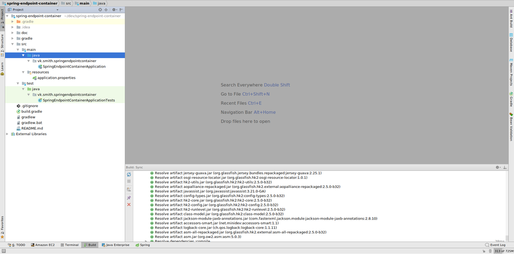
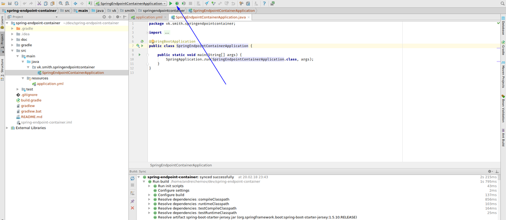
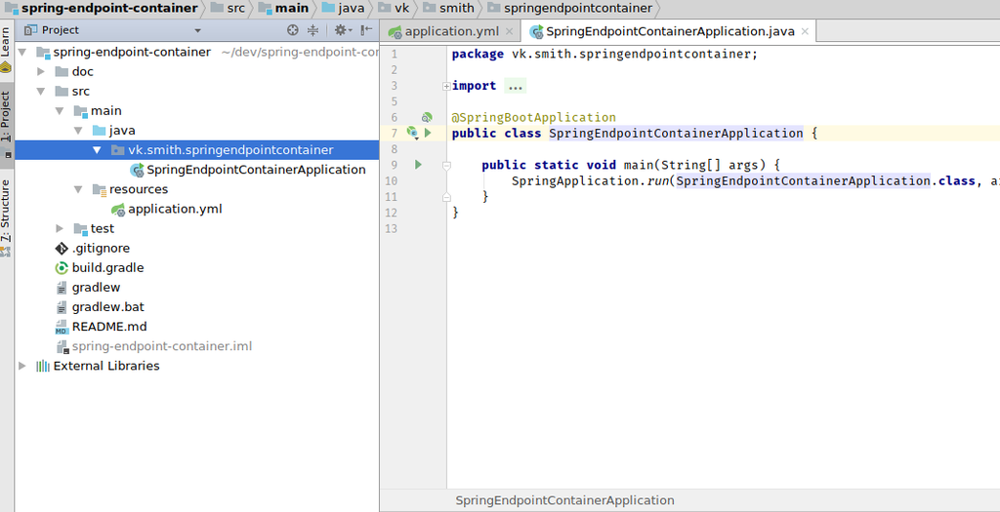
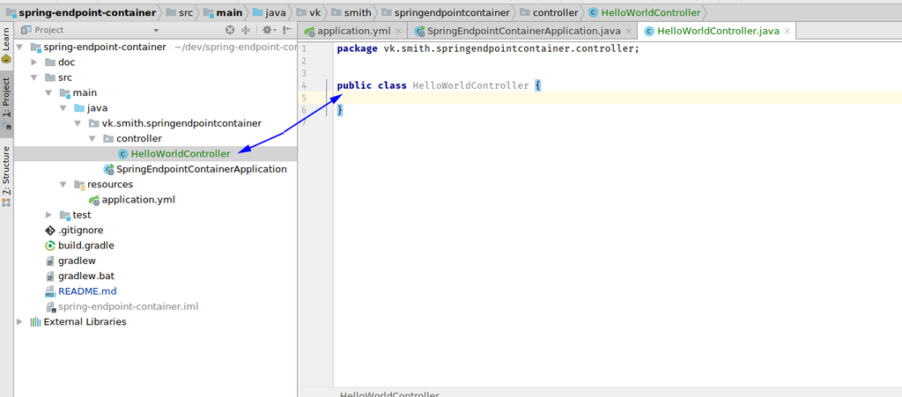

# Spring endpoint container #

TODO:

1. Create a Spring.io + Gradle seed project for end-point returning json payload: `{"message": "Hello World"}`, commit to Bitbucket.org repository
2. Create a script to setup up Jenkins server on Amazon Linux AMI 2017.09
3. Setup Continuous Deployment Job on Jenkins to build the source code inside a Docker container with Dockerfile inside the same repository. That to isolate build dependencies inside the build container instead of the Jenkins host
4. Build alpine linux based docker image with the end-point in the image ready to launch
5. Push newly build image to a hub.docker.com

## Create a Spring.io gradle project for end-point returning json payload: `{"message": "Hello World"}`

1. Open [start.spring.io](https://start.spring.io/)

2. Select `java`, `gradle` and select version `1.5.10`. Enter `group` field and `artifact` field. 
Type `DevTools`, `Web` and `Jersey` in the dependencies field

    

3. Click on `generate project` and download to your dev folder.

4. Unpack archiv.

5. Open project in the Intellij IDEA

    

    

6. Click on `import gradle project`

    

7. All by default here exclude Gradle jvm field. Select your jdk.

    

8. If all previous step was ok then you see next screen

    

9. On this step git not init also. You can do it using menu `VCS` -> `Enable Version Control Integration`. Then select git (if git not exist in menu you need install git to your system. Ubuntu Example `sudo apt-get install git`)

    

10. Right click on `application.properties` file and select `refactor` -> `rename`. Rename it to `application.yml`

    

11. On this step you can run you app because IDEA already detect that there is Spring App

    

12. App is started on 8080 port by default. Stop app after this check.

    

13. To add endpoint we should create package `controller`. Right click on base package and select `new`->`package`. Enter `controller` to input field.

    

14. Then click on this package and select `new`-> `class`. Type `HelloWorldController` to input field.

    

    

15. Add annotation `@RestController` to this class

    

16. Add method `getHelloWorld()` and create response class `HelloWorldResponse`
    ```java
        @GetMapping(path = "/helloworld")
        public HelloWorldResponse getHelloWorld(){
            return new HelloWorldResponse();
        }```
-
    ```java
    package vk.smith.springendpointcontainer.controller.responses;
    public class HelloWorldResponse {
        private String message = "Hello World";

        public HelloWorldResponse(String message) {
            this.message = message;
        }

        public HelloWorldResponse() {

        }

        public String getMessage() {
            return message;
        }

        public void setMessage(String message) {
            this.message = message;
        }
    }```

17. Set server port in `application.yml` to `8081`.
    ```yaml
    server:
        port: 8081
    ```

18. Now we can run app and check that endpoint is works.

    

## Create a script to setup up Jenkins server on Amazon Linux AMI 2017.09

1. Check that you have launched an Amazon Linux with a public DNS address and that you have SSH access (see security group) and requests to 80 / 8080 port is opened for this instance.

2. Run bash script from project root dir to install jenkins on AWS linux. Recommend to use. `ec2-user` - ssh user on AWS. `18.219.230.179` - ip of AWS machine. `~/.ssh/id_rsa` - path to your private ssh key.
    ```
       bash install_aws_jenkins.sh ec2-user 18.219.230.179 ~/.ssh/id_rsa
    ```

    Or your can download script from bitbucket

    ```
        curl -O https://bitbucket.org/andreichern0v/spring-endpoint-container/raw/d047f436b9895ebc24684ec3b3d2888f1f6c56ab/install_aws_jenkins.sh && chmod 755 install_aws_jenkins.sh && bash install_aws_jenkins.sh && rm install_aws_jenkins.sh
    ```
3. At the end of script working you will see link to Jenkins instance and admin password.

## Build docker image local
You can build docker image and run app on local machine using next steps:

1. Build docker image from **initializr** repository branch
    ```
        docker build -t icssolutions.ca/end-points.io:initializr .
    ```
    or from **master** branch
    ```
        docker build -t icssolutions.ca/end-points.io:master .
    ```
2. Run container with app. Spring Boot app is configured to use **8081** port then we need forwarding to this port.
    ```
        docker run -it -p 8081:8081 icssolutions.ca/end-points.io:initializr
    ```
3. Check that endpoint is working. Open browser and open link `http://localhost:8081/helloworld`

## Jenkins Project Setup

1. After login using `"Jenkins public ip"` from setup script, password from line `"Jenkins admin password"` and skiped! all wizard steps you can see Jenkins main page:


2. Click  **create new jobs**. Enter project name `spring-endpoint-container`, select **Pipeline** and click **ok**.

    

3. Scroll down to section **Pipeline**. Then:
    1. Select **Pipeline script from SCM` in dropdwon list (1)
    2. Select **Git** as SCM
    3. Paste into **repository url** url of repository, for example `https://andreichern0v@bitbucket.org/andreichern0v/spring-endpoint-container.git`
    4. Paste into field **Branch specifier** repository branch, for example `refs/heads/feature/initializr`
    5. Check that **Script path** filed contain `Jenkinsfile`.
    6. Click **Save**
    

4. 
